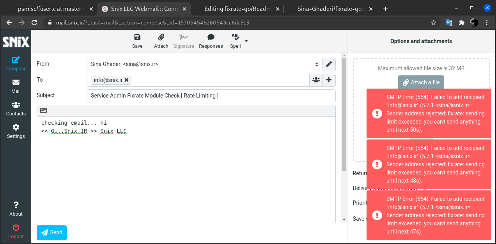

# fixrate-go
last night we figured out someone sending too many emails to our mailing servers, so this is the tool for handling those email flooding attacks.  
fixrate applies sending rate limit per users, so you don't have to limit entire domain. from now on fixrate protects [mail.snix.ir](https://mail.snix.ir) service.  

### usege and installation
fixrate is written in golang, so for compiling this code you should have `golang` installed.  
if not, use apt to installed `apt install golang`, after that clone this repository by useing either [git.snix.ir](https://git.snix.ir/fixrate-go) or github.com  
```
# git clone https://git.snix.ir/fixrate-go.git
# git clone https://github.com/Sina-Ghaderi/fixrate-go.git
# cd fixrate-go && go build

# ./fixrate-go
expected 'daemon' or 'users' commands
usage of fixrate postfix module snix.ir LLC:
./fixrate commands... [ OPTIONS ] ...

commands:
  daemon         starting fixrate daemon, should be used by systemd
    --config     pass a file to read configuration from. default: ./fixrate.conf

  users          add or modify users and attributes in database
    --config     pass a file to read configuration from. default: ./fixrate.conf
    --username   a username to add/modify in database. default is sina@snix.ir
    --counter    time interval (seconds) between user counter reset. default is 120
    --userrate   how many e-mails user should be able to send. default is 10

example: 
---- adding name@domain.com ---- 100 e-mail per 10 minutes:
./fixrate users --username name@domain.com -- userrate 100 --counter 600

Copyright (c) 2021 git.snix.ir, All rights reserved.
Developed BY sina@snix.ir --> Sina Ghaderi  
This work is licensed under the terms of the MIT license.
```
you may wnat to create a systemd file for runing this as a linux service (`systemctl start` ... and `enable` etc...)

### config postfix and fixrate 
fixrate-go supports unix socket and tcp network listeners, in order to reduce kernel opened connections its recommended to use unix socket if you can host fixrate on postfix server  
default configuration file of fixrate is `./fixrate.conf`, you may want to specify another file path by using `--config` flag  

### preparing postfix server
edit postfix mail agent config file under `/etc/postfix/main.cf` (debian based systems)  
if planning to use unix file you should note that for some reasons postfix root directory is under `/var/spool/postfix` so you need to create fixrate-go socket file under this directory, otherwise you may facing with `warning: connect to <socket> no such a file or directory` warning in` mail.log` file 
```
## if using unix socket -->
# echo "smtpd_sender_restrictions = reject_unknown_sender_domain, check_policy_service unix:/fix/fixrate.sock" >> /etc/postfix/main.cf
# mkdir /var/spool/postfix/fix
# service postfix restart 

## if useing tcp connection --> 
# echo "smtpd_sender_restrictions = reject_unknown_sender_domain, check_policy_service inet:127.0.0.1:9984" >> /etc/postfix/main.cf
# service postfix restart
```

### config fixrate-go service
just use default config file in this package `fixrate.conf` and change it as you need.
you should set MYSQL user/pass/database/address parameters in order to connect to sql server.
if choosing to use unix or inet remember to set corresponding parameters followd by `listener_type =` literal.  
default fixrate config file `fixrate.conf`
```
## Mysql(or mariaDB) database to use 
sql_database = postfix
## sql connection port number
sql_tcpport = 3306
## sql username to connect database 
sql_username = postfix
## sql password to connect database
sql_password = Pass1234
## sql server address 127.0.0.1 .... 
sql_address = 127.0.0.1

## Default rate limit plan for users that not exists in database yet.
## first parameter is number of emails and the next one is time interval (Seconds) between user counter reset
## following parameters determine that users only can send 10 e-mails per 120 seconds
## note that if you change specific user by fixrate users command, this not effect that user anymore.  
default_ratelimit =  10 120

## fixrate listening mode can be only unix or inet, if you want to connect this service over TCP protocol
## should use inet, for using unix socket files should unix be used. 
listener_type = unix

## config for unix listener type, ignored if use inet
## socket file should be under /var/spool/postfix/ 
## REMEMBER to mkdir directory /var/spool/postfix/fix/ first
socket_path = /var/spool/postfix/fix/fixrate.sock

## socket file should be read and writable by both fixrate and postfix services.
socket_perm = 666

## config for inet listener type ignored if use unix
listen_addr = 127.0.0.1:9984
```

### screenshots
an smart ass user, limited as below


### licence and contact
you are welcome to e-mail me, suggestions, bug reporting or anything else, ... use [sina@snix.ir](mailto://sina@snix.ir)

Copyright (c) 2021 git.snix.ir, All rights reserved.
Developed BY sina@snix.ir --> Sina Ghaderi  
This work is licensed under the terms of the MIT license.
